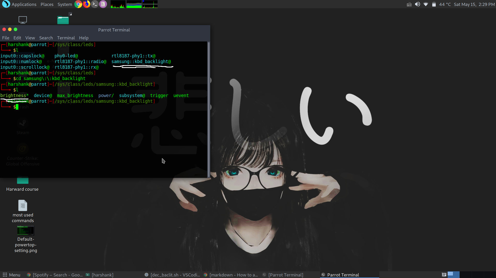
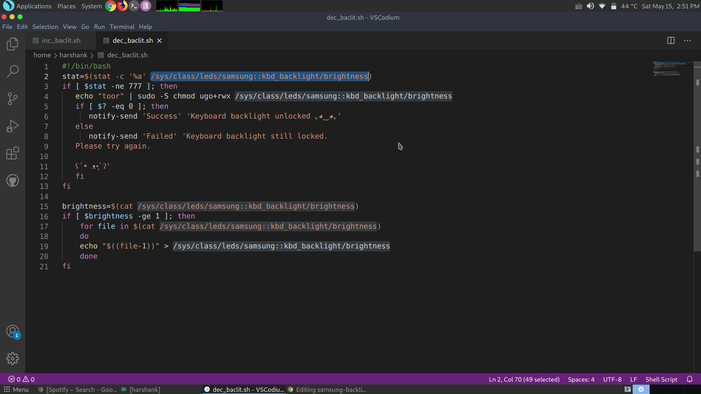
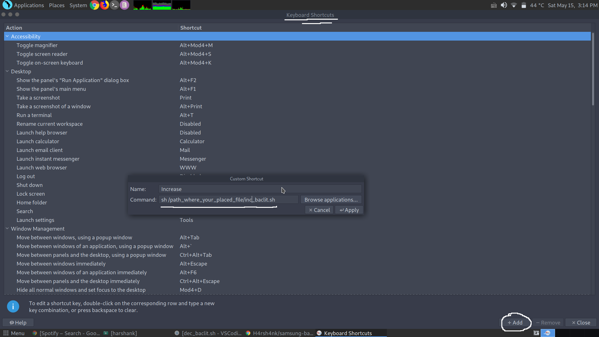

# samsung-backlight-linux
Fn bind for backlight control for any laptop for linux systems.

Brief: 
     _Due to some driver issue I was not able to control my keyboard backlight with Fn keys. Futher I searched on Google and Stack but found nothing. So, I decided to my a script for others like me._ (◕ᴗ◕✿)
  
## Step 1
Copy these files in your pc.
Locate backlight folder for you pc.
Normally it should be **`/sys/class/leds/your_device::backlight/brightness`**

 

## Step 2
Edit the path in both files i.e. **`/sys/class/leds/samsung::kbd_backlight/brightness`**
with your devices specificpath you found in **Step 1**

 

And replace **"toor"** with your user password 

## Step 3
Bind 2 keyboard shorcuts :

 

### 1 **`sh /path_where_you_placed_file/inc_baclit.sh`**   _// increasing backlight brightness_
### 2 **`sh /path_where_you_placed_file/dec_baclit.sh`**   _// decreasing backlight brightness_

## Step 4 
Enjoy

# (˘︶˘).｡*♡

ps. I have included **one_key_bind** file. It changes the brightness in following loop : off -> low -> med -> high ...
